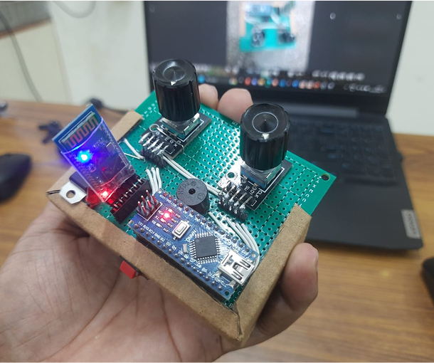
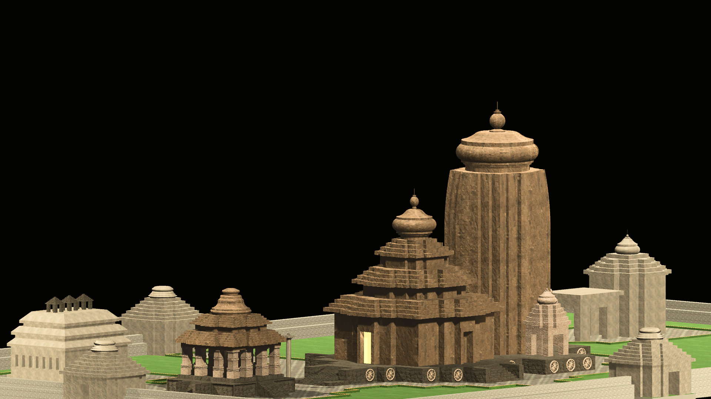
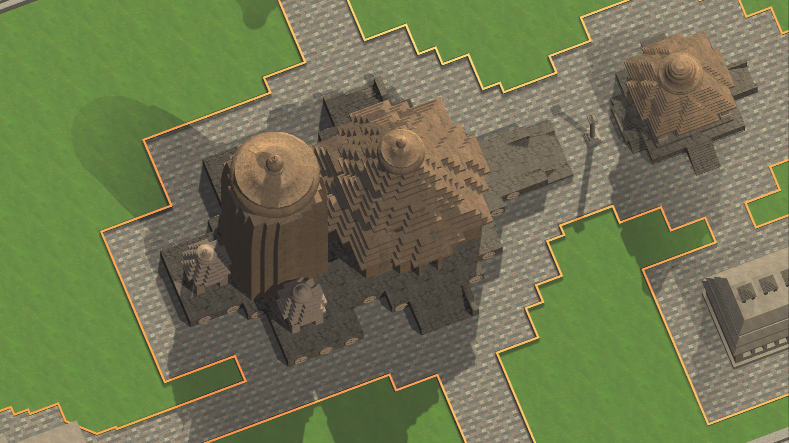
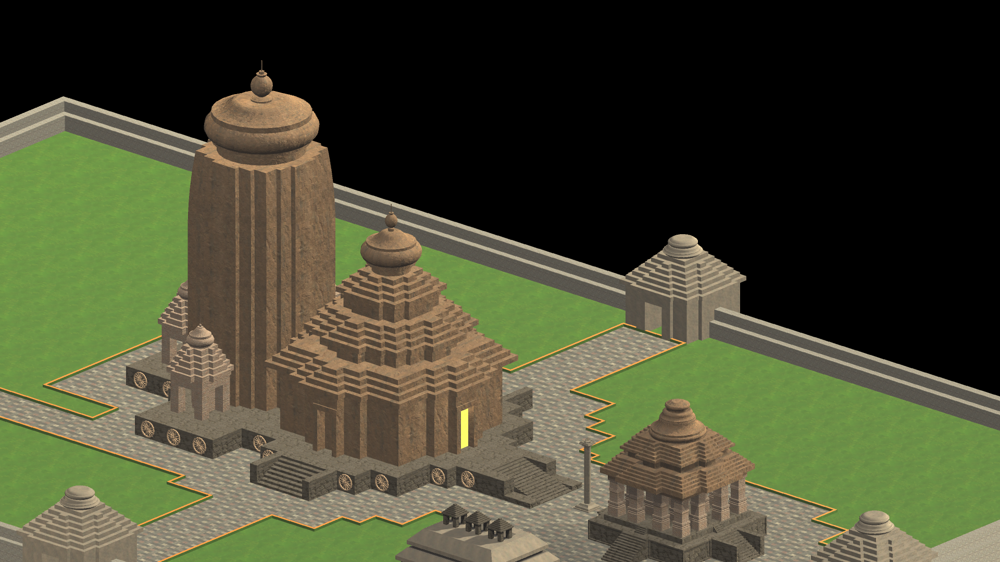

     

# **VIRTUAL REBIRTH OF KONARK SUN TEMPLE**

This is a course project done uder the requirements of AM5511-IITM .
The main aim of this project are
- [x] Rebuild the  Konark using VR and 3D modeling technology.
- [x] Develop Handhold Controller to navigate
- [x] Haptic feedback of collision

---

The project was achieved by following these steps.

|  |  |
|--------------------------------|--------------------------------|

### GALLERY of Rendered Images of the project

|  |  |  |
|--------------------------------|--------------------------------|--------------------------------|
|  |  |  |
|  |  |  |
|  |  |  |

### Behind The Scene

  